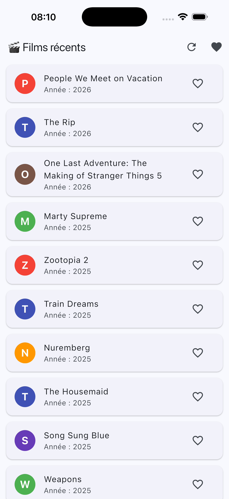
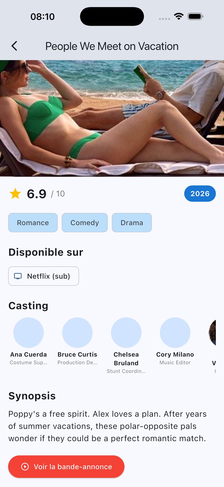

# 🎬 TP4 - Films Watchmode (API)

Bienvenue sur le projet **TP4 - Films Watchmode**. Cette évolution de l'application connecte désormais l'interface à une véritable API distante (**Watchmode**) pour récupérer les données en temps réel, remplaçant les données statiques JSON.

## 📱 Aperçu de l'application

> **Note** : captures d'écran dans le dossier `screenshots` à la racine pour qu'elles apparaissent ici.

| Liste API | Détails Film |
|:---:|:---:|
|  |  |
| *Chargement dynamique et Pull-to-refresh* | *Données complètes (Note, Trailer, Genres)* |
