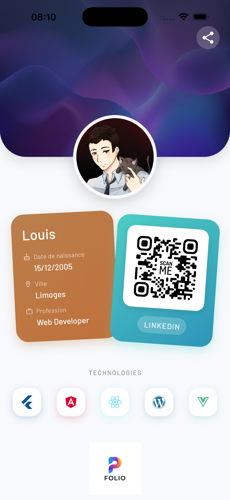

# 📱 Portfolio Card App - TP1

Bienvenue sur le dépôt de mon application **Portfolio Card**. Ce projet a été réalisé dans le cadre du TP1 du cours de Flutter. Il s'agit d'une carte de visite interactive et stylisée permettant de présenter mon profil, mes compétences et mes réseaux.

## 🖼️ Galerie & Aperçu

Voici à quoi ressemble l'application.

> **Note** : Ajoute tes captures d'écran dans le dossier `screenshots` à la racine du projet pour qu'elles s'affichent ici.

| Accueil |
|:-------:|
|  |
| *Vue principale avec les cartes* |
