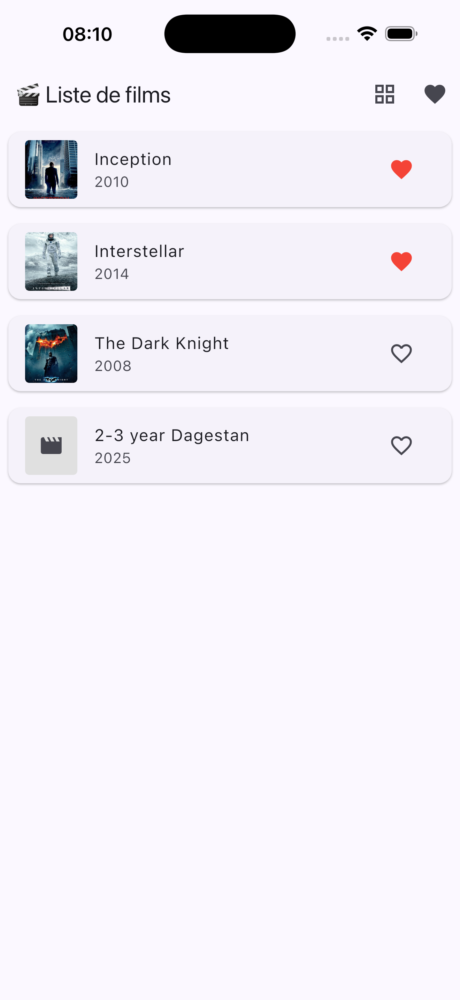
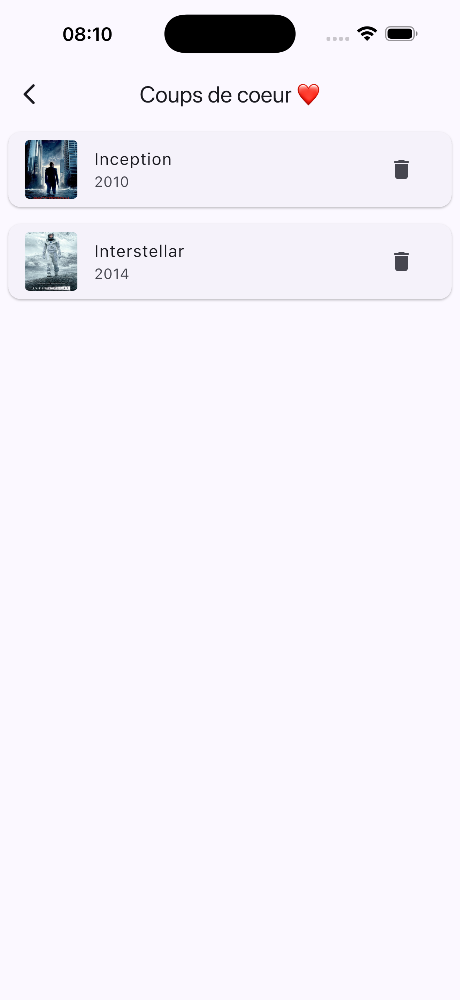
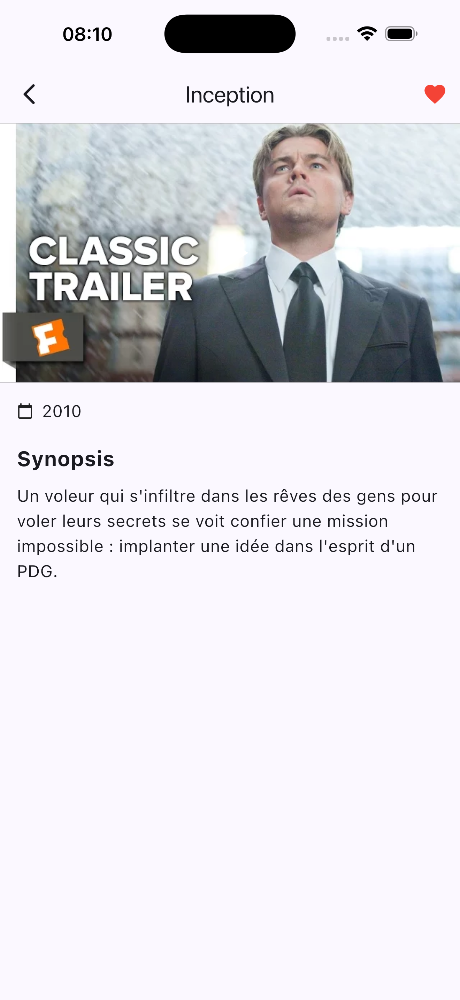

# 🎬 Movie App - TP3

Bienvenue sur le projet **TP3 - Liste de films**. Cette application Flutter permet de naviguer dans une bibliothèque de films chargée depuis un fichier JSON local, de consulter les détails et de gérer une liste de favoris.

## 📱 Aperçu de l'application

> **Note** : captures d'écran dans le dossier `screenshots` à la racine pour qu'elles apparaissent ici.

| Liste des Films | Favoris | Détails |
|:---:|:---:|:---:|
|  |  |  |
| *Navigation principale* | *Gestion des favoris* | *Fiche complète* |
