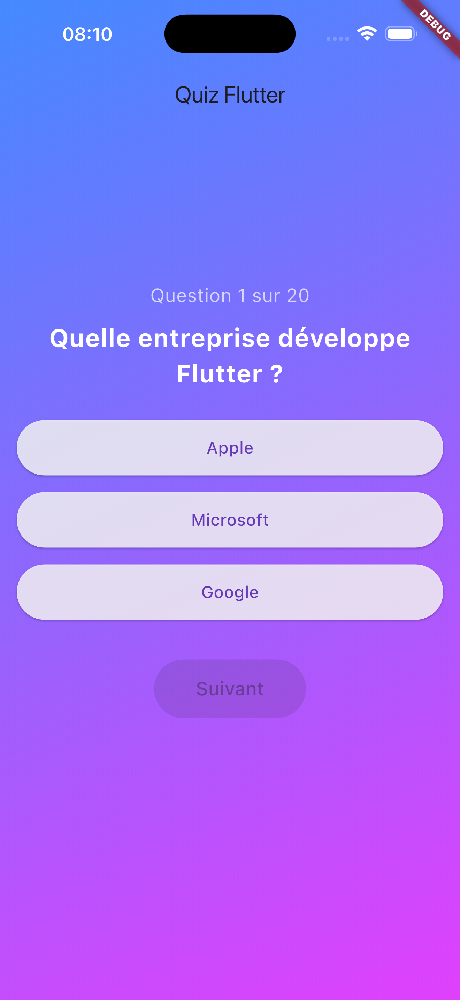
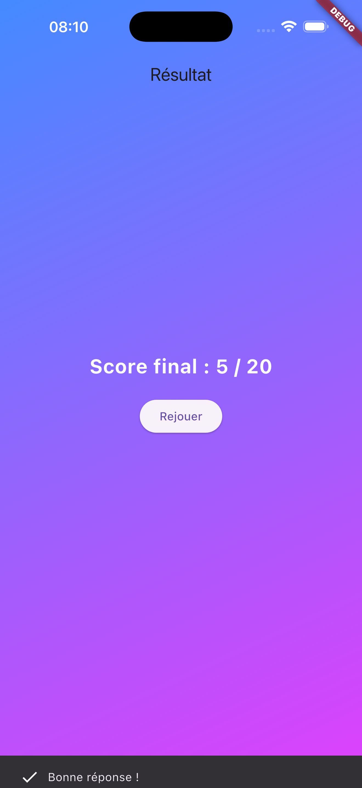

# ❓ Quiz Interactif - TP2

Bienvenue sur le projet **TP2 - Quiz Flutter**. Cette application est un jeu de questions-réponses interactif développé pour apprendre la gestion d'état (`setState`) et la manipulation de listes en Flutter.

## � Aperçu de l'application

> **Note** : captures d'écran dans le dossier `screenshots` à la racine pour qu'elles apparaissent ici.

| Question en cours | Résultat Final |
|:---:|:---:|
|  |  |
| *Interface du quiz avec sélection* | *Score final et bouton replay* |
